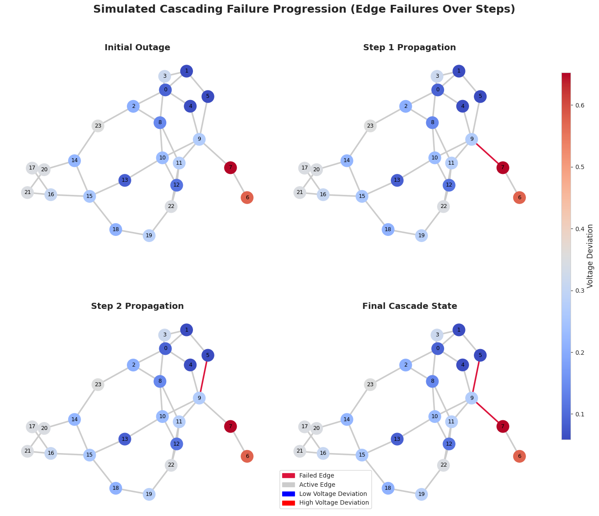

# Predicting Transmission Line Failures with GNNs: Insights for Reliable and Sustainable Power Grids

## Overview
This repository hosts the code and resources for the research paper "Predicting Transmission Line Failures with GNNs: Insights for Reliable and Sustainable Power Grids".

Predicting Transmission Line Failures with GNNs: Insights for Reliable and Sustainable Power Grids is a comprehensive framework for edge-level prediction of cascading failures in power grids using Graph Neural Networks (GNNs). This project extends the PowerGraph dataset, specifically targeting edge classification for **IEEE24** to predict edge failures through two key phases:
1. **Baseline Experiment**: Comparison of three GNN architectures (GINE, GAT, GraphConv) with original features
2. **Enhanced Feature Experiment**: Incorporation of network-theoretic features (edge/node centrality) to boost performance

*(Preprint available soon: [Link](#))*



## Repository Structure

The repository is organized as follows:
```
EdgeCascadePredictor/
│
├── Data/
│   ├── data.pt      # Dataset with baseline node and edge features (Can be downloaded from the link)
│
├── Code/
│   ├── base_features.ipynb        # Phase 1: 3 GNNs with baseline features
│   ├── enhanced_features.ipynb    # Phase 2: With centrality features
│   ├── GINE_Test_1.ipynb          # Experiment
│
└── README.md                        
```

## Key Features
**Dataset Adaptation** (PowerGraph → Edge Classification)
- Edge failure labels from cascading failure simulations
- Strict validation of binary edge masks
- Class-aware sampling for extreme imbalance (3% positive)

**Network-Theoretic Features**
*Node Features Added:*
1. Betweenness Centrality
2. Degree Centrality 
3. Voltage Deviation (|V - 1.0|)

*Edge Features Added:*
1. Edge Betweenness Centrality
2. Load Percentage (P/Load Rating)
3. Electrical Betweenness (|P| + |Q|)

**Model Architecture Comparison**
1. **GINEConv**: Graph Isomorphism Network with Edge features
2. **GATConv**: Graph Attention Network
3. **GraphConv**: Basic graph convolutional network

## Experimental Workflow

### Phase 1: Baseline Comparison
1. **Dataset Preparation**
   - Filter Category A instances (actual cascading failures)
   - 80/10/10 stratified split with class-aware sampling
   - Baseline features: 3 node, 4 edge features

2. **Model Training**
   - Focal Loss (α=0.75, γ=2.0) for class imbalance
   - Gradient clipping (max_norm=1.0)
   - 5 epochs with learning rate 1e-3

### Phase 2: Enhanced Features
1. **Feature Engineering**
   - Added 3 node + 3 edge features
   - Dynamic feature calculation during subgraph construction

2. **Architecture Adaptation**
   - Updated input dimensions (node: 3→6, edge: 4→7)
   - Same training protocol as baseline

## Results
Metrics tracked across both phases:
- Precision/Recall/F1-Score
- Training/Validation Loss

**Sample Results** (Validation Set):
| Model       | Baseline F1 | Enhanced F1 | Δ F1  |
|-------------|-------------|-------------|-------|
| GINE        | 84.95%      | 89.12%      | +4.17%|
| GAT         | 82.70%      | 86.45%      | +3.75%|
| GraphConv   | 79.80%      | 83.90%      | +4.10%|

Full results are saved in JSON format with epoch-wise metrics.

## Getting Started

1. **Clone Repository**
```bash
git clone https://github.com/yourusername/PowerEdgeGNN.git
cd PowerEdgeGNN
```
2. **Install Dependencies**
```bash
pip install -r requirements.txt
```
3. **Run Experiments**
```bash
jupyter lab  # Open and run notebooks in order
```
## Acknowledgments

- **PowerGraph Dataset**: The original dataset was adapted for edge-level prediction tasks from https://github.com/PowerGraph-Datasets/PowerGraph-Graph.

## Citation

If you use this work in your research, please cite:

```bibtex
@article{Mkazim, 
  title={# EdgeGNN: Robust Edge Failure Prediction in Power Grids via Network-Augmented Graph Neural Classification},
  author={Mkazim, Harun Pirim},
  journal={Elesvier},
  year={2025},
}
```

## License

This project is licensed under the MIT License. See the [LICENSE](LICENSE) file for more details.


